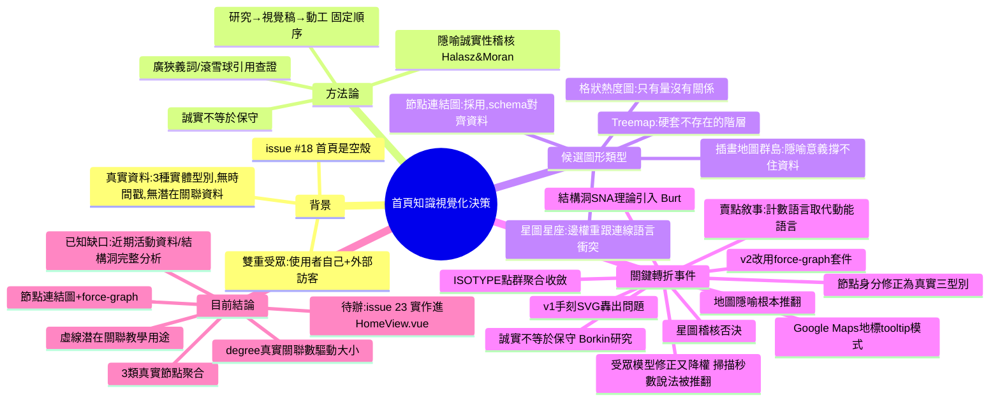

> 對應 `jerryyehself/my-dev-grid-front` issue #18（首頁重新設計）。這份文件記錄整個決策過程的
> 前因後果、考慮過的圖形類型、引用的文獻、討論中的關鍵轉折，供之後回顧「為什麼是這個方向」時查。
> 每日對話摘要（`summaries/2026-09-02.md`）只留一段精簡版連結到這裡；細節以本檔為準。

## 1. 背景與動機

`my-dev-grid-front` 的首頁（`HomeView.vue`）目前是空殼（`<template><main></main></template>`）。
issue #18 要在首頁放一個小型視覺化元件，呈現「近期知識活動」。這個網站有雙重受眾：

- **使用者自己**：追蹤自己的知識/技能累積。
- **外部訪客**：技術背景的訪客也可能點進首頁。

真實資料模型（`my-dev-grid` 後端 `GraphController` / `/api/graph`）由三種實體型別構成：
`documentation`（文件）／`technique`（技術）／`implementation`（實作），節點只有 `id/type/label`，
邊只有 `source/target/predicate/label/relation_id`——**不含時間戳，也不含任何「潛在但未實現關聯」
的資料**。這兩個資料缺口在整個討論過程中反覆被提起，也是最終定案時明確標註「先不畫」的部分。

## 2. 決策方法論

整個過程確立並反覆套用了幾條方法：

1. **固定順序：先查文獻/套件慣例 → 再產視覺稿 → 最後才動工**，寫進了
   `my-dev-grid-skills/docs/engineering-principles.md`（「New visual/design work follows a
   fixed order」）。這條規則本身就是被這次任務的第一版 mockup（跳過查證直接畫圖）反向逼出來的。
2. **隱喻誠實性稽核**：每個新的視覺隱喻候選，都用「這個隱喻幫使用者預設了多少現實世界的意義，
   而這些意義有沒有真實資料撐著」的標準逐一檢驗（根據 Halasz & Moran 1982，見第 5 節文獻）。
   地圖、指北針、島嶼形狀、星圖都是用同一套標準被系統性地否決，不是逐個補丁修掉。
3. **廣狹義詞/滾雪球引用法**：查證文獻時不只是關鍵字查詢，會往上下游擴大檢索範圍、追citation，
   確認一手來源，不接受只憑印象的結論（例如「訪客只花 6-7 秒掃描」的說法就是這樣被查出禁不起檢視）。
4. **誠實 ≠ 保守**：這是討論中段被使用者明確糾正的一個混淆——拿掉不誠實的隱喻裝飾之後，
   不代表要退到最簡陋的版本；「誠實」跟「大膽/精緻」是兩個獨立的軸，可以同時成立（見第 4.3 節）。

## 3. 考慮過的圖形類型比較

| 類型 | 隱喻/性質 | 優點 | 缺點／被拒理由 | 是否採用 |
|---|---|---|---|---|
| 格狀熱度圖（grid heatmap） | 矩陣式熱度編碼 | 簡單、跟「數量/熱度」資料維度直接對齊 | 只能表達「量」，表達不出項目之間的 relationship，跟後來確定的賣點（關係／技術可信度）不合 | 否，早期比較基準之一 |
| Treemap（Squarified algorithm） | 層級面積編碼 | 面積比例直覺，貌似適合套 Scope 分類階層 | 資料本質是網路關聯，不是嚴格樹狀；硬套階層會發明出資料裡不存在的父子關係 | 否 |
| 插畫地圖／群島（illustrated island map） | 地圖／地形隱喻 | 視覺敘事感強、吸睛 | 地圖隱喻自帶比例尺／方位／陸地海洋邊界等大量預設意義，實際資料只有 3 個維度撐不住這些意義；逐項補丁（拿掉指北針、質疑島嶼形狀）之後才發現是同一個根本問題（Halasz & Moran） | 否，根本性推翻，不是逐項修掉 |
| 星圖／星座（star chart / constellation） | 天文隱喻 | 亮度＝數量的類比站得住；點群聚合的視覺語言天然好看 | 星座連線是「統一、無權重」的視覺語言，跟我們需要用粗細編碼真實關聯數量的邊直接衝突（不是氛圍問題，是結構性矛盾）；暗色背景踩到跟地圖一樣的「海洋」問題；星座意涵「固定、古老」跟「最近活動」的時間維度衝突 | 否 |
| 節點-連結圖（node-link / force-directed graph） | 圖論／社會網絡隱喻 | schema 剛好對齊實際資料的維度（身份、數量、關聯權重、演算法算出的位置），可以直接當作 `/graph` 知識圖譜頁的縮小預覽而不是憑空隱喻；延展性好，`degree`（真實關聯數）可以誠實地驅動視覺大小 | 純手刻視覺容易做成陽春demo，需要挑對套件才能有專業感 | **採用** |

## 4. 討論過程的關鍵轉折（依時間順序）

### 4.1 起點：Google Maps 地標式 tooltip 互動模式
確立「點擊展開詳細內容」的 tooltip 模式（類似 Google Maps 點地標彈出資訊卡），但明確排除套用到
簡單列表項目（如近況板），因為 PR #30 曾經因為「只支援 hover 觸發、手機版完全用不到」出過真實
bug——同一種「互動只服務用得到滑鼠 hover 的那群人」設計缺陷，之後在討論受眾切換方案時又被同一個
標準抓到一次（見 4.4）。

### 4.2 地圖／群島隱喻整條被推翻
最初方向是熱度圖 → 地標 tooltip → 比較格狀熱度圖／Treemap／插畫地圖幾種形狀。地圖版本一路被追問
「位置代表什麼」「邊界形狀代表什麼」「指北針代表什麼」「島嶼形狀本身代表什麼」，每次都補一個丁，
直到意識到這是治標不治本：真正的問題是借用了一個表達力遠超過實際資料維度的隱喻。改用
**節點-連結圖**，schema 直接對齊實際資料維度，並順勢變成 `/graph` 頁的縮小預覽。

### 4.3 「誠實但不能因此就變保守」
拿掉地圖裝飾後一度想退到最簡單的圓點＋細線版本，被指出這是把「誠實」跟「保守」混為一談。查了
Borkin et al.（TVCG 2013）視覺化記憶度研究，證實密度高、裝飾多的圖表反而比極簡風格更容易被記住
（滾雪球查證後修正：密度有利主題/印象記憶，不利精確數值記憶，見第 5 節）。最終方向：大膽執行，
但每個視覺選擇都要能被解釋、且投入要跟網站實際內容深度成比例。

### 4.4 受眾模型修正，後又降權
一開始只想到使用者自己跟技術訪客，後來把外部訪客也納入受眾。曾經提案
「做兩套圖用 UI 切換」，被自己推翻——opt-in 機制會把簡單版本餵給最不需要它的那群人（跟 4.1 的
PR #30 教訓同一類錯誤），改用漸進揭露（文字先講重點，圖形本身留給互動深挖）。最後一輪查證發現
「訪客只花 5-7 秒掃描」這個常被引用的說法禁不起檢視——自家商業機構出的、非
同儕審查、約 30 人樣本、方法論不透明，而且測的不是網站。**結論：不該讓一個站不住腳的假設
限制圖形的野心**，受眾考量的權重因此調低（見第 5 節文獻）。

### 4.5 節點身分修正
第一版 mockup 的節點分類名稱（「前端工程」「知識圖譜」等）是自己編的示範內容，沒有對照真實資料庫，
被當場抓到。真正的節點單位是 `/api/graph` 已定義好的三種實體型別：Documentation／Technique／
Implementation。進一步要求「群內／群間關聯都要看得到」——這後來收斂成「首頁看群間，`/graph` 頁看
群內個體關聯」的分工。

### 4.6 引入結構洞／社會網絡分析理論
提出借用 Ronald Burt 的 structural holes（結構洞）與 betweenness centrality（中介節點）理論，
區分「已實現的連結」跟「有間接證據支持、可能值得搭橋的潛在連結」，用實線／虛線視覺區分。對外文案
建議用工程語言表達（「關鍵中繼節點」「還沒搭橋的共同依賴」），不直接點名學術理論（Burt/SNA）、不用學術詞彙。
範圍上定案：完整的結構洞分析屬於 `/graph` 頁的功能，首頁只留一個誠實的預告入口，不做假資料的完整
分析。

### 4.7 星圖隱喻提出又否決
「星團」的說法讓人聯想到天文圖/星圖隱喻，拿去用同一套 Halasz & Moran 誠實性標準審查——結論見
第 3 節表格。星圖隱喻被拒的判準比地圖更明確（邊權重編碼跟星座連線的視覺語言直接衝突），縮放結構
（聚合→個體）改引用 Perlin & Fox 的 semantic zoom 跟 Furnas 的 degree-of-interest 理論，不需要
天文館軟體的說法撐場。

### 4.8 ISOTYPE 點群聚合收斂
「3 個聚合節點，每個節點內部是一群真實記錄各一個點」的設計，比原本考慮過的尺寸縮放方案更好——
徹底讓 Flannery（1971）圖形尺寸感知偏差／Stevens 冪次定律的縮放校正問題消失，因為數量是用可數的
單位表示，不是用放大面積表示，呼應 Otto Neurath 的 ISOTYPE 原則（用重複計數表示數量，不用放大
單一符號）。

### 4.9 賣點敘事建議
在「這個元件的賣點到底要呈現什麼」這個問題上，比較過幾個候選框架（connectivity／momentum／
technical credibility／audience-specific），最終建議：技術可信度定調這個元件本身「是什麼」，
簡短文字句給快速訪客的第一印象，關係／connectivity 正確地降級為深挖後才看到的內容。文案用計數/
涵蓋範圍語言（「N 份文件、M 個技術、K 個實作，由 R 條關聯串成」），不用「持續開發中」這種動能
語言——動能宣稱很脆弱，活動窗口一旦冷靜下來，反而變成對自己不利的證據。

### 4.10 v1 手刻 SVG → v2 改用專案既有套件
第一版視覺稿是手刻的 SVG＋自製簡易力學模擬，被指出「圖例太大搶焦點」「點小點彈出整群資訊」
「虛線意義看不懂」「邊點不開看關聯定義」「畫面像大學生海報展」等具體問題，並被提醒要重新查一次
「現在既有的連結資料或社會網絡比較好看的套件」。查證後發現 `/graph` 頁自己（`GraphPoc2D.vue`）
早就在用 `vasturiano/force-graph`（Canvas 渲染、內建力學模擬／拖曳／hover）取代掉更早期手刻的
SVG 版本，而且這個套件本來就是專案既有的 npm 依賴。改用同一套後，個別節點可點看自己的內容、
邊可點/hover 看真實 predicate、節點大小改用真實的 `degree`（關聯數）驅動而不是編出來的權重，
視覺質感直接對齊「真的社會網絡分析工具」而不是手畫的形狀。

## 5. 相關文獻

| 主題 | 文獻 | 連結 |
|---|---|---|
| 隱喻的根本風險 | Halasz, F. & Moran, T.P. (1982), *Analogy Considered Harmful*, CHI 1982 | https://dl.acm.org/doi/abs/10.1145/800049.801816 |
| 空間相似 ＝ 概念相似的認知偏差 | Fabrikant, S.I. & Montello, D.R. (2008), *The effect of instructions on distance and similarity judgments in information spatializations*, IJGIS, vol. 22, pp. 463–478 | 無直接 DOI 連結，期刊卷期頁碼可查（IJGIS 目次） |
| 曲線形狀的視覺偏好 | Bar, M. & Neta, M. (2006), *Humans Prefer Curved Visual Objects*, Psychological Science, vol. 17, no. 8, pp. 645–648 | https://journals.sagepub.com/doi/10.1111/j.1467-9280.2006.01759.x |
| 視覺化記憶度：密度不是壞事 | Borkin, M.A. et al. (2013), *What Makes a Visualization Memorable?*, IEEE TVCG, vol. 19, no. 12, pp. 2306–2315 | https://dl.acm.org/doi/10.1109/TVCG.2013.234 |
| 記憶度的後續修正：印象記憶 vs 精確數值記憶 | Borkin, M.A. et al. (2016), *Beyond Memorability: Visualization Recognition and Recall*, IEEE TVCG, vol. 22, no. 1, pp. 519–528 | https://dl.acm.org/doi/10.1109/TVCG.2015.2467732 |
| 裝飾對理解/記憶的影響（前驅研究） | Bateman, S. et al. (2010), *Useful Junk? The Effects of Visual Embellishment on Comprehension and Memorability of Charts*, CHI 2010, pp. 2573–2582 | https://dl.acm.org/doi/10.1145/1753326.1753716 |
| 動畫轉場 | Heer, J. & Robertson, G. (2007), *Animated Transitions in Statistical Data Graphics*, IEEE TVCG（InfoVis 2007） | https://dl.acm.org/doi/10.1109/TVCG.2007.70539（注意：原論文只驗證統計圖表如長條圖/散佈圖，沒有驗證力導向節點圖，本專案的引用是類比而非直接驗證） |
| 圖形尺寸感知偏差校正 | Flannery, J.J. (1971), *The Relative Effectiveness of Some Common Graduated Point Symbols in the Presentation of Quantitative Data*, Cartographica, vol. 8, no. 2, pp. 96–109 — 「Flannery scaling」，關聯 Stevens 冪次定律（心理物理學） | https://www.semanticscholar.org/paper/0fc8f6e7aee5f02ef9c7e9da467685dfabd57f6b |
| 用重複計數表示數量，不用放大單一符號 | Otto Neurath, ISOTYPE (International System of Typographic Picture Education)，代表著作 *International Picture Language*（1936） | https://isotype.univie.ac.at/en/ |
| 結構洞／社會網絡中介理論 | Burt, R.S. (1992), *Structural Holes: The Social Structure of Competition*, Harvard University Press | https://www.hup.harvard.edu/books/9780674843714 |
| 語意縮放 | Perlin, K. & Fox, D. (1993), *Pad: An Alternative Approach to the Computer Interface*, SIGGRAPH 1993, pp. 57–64 | https://mrl.cs.nyu.edu/~perlin/pad-siggraph.pdf |
| 階層聚合／degree-of-interest | Furnas — fisheye / degree-of-interest 相關研究 | http://vis-ucb-maneesh.stanford.edu/files/chi06/Furnas_p999.pdf |
| 視覺吸引力的第一印象與可信度月暈效應 | Lindgaard, G. et al. (2006), *Attention web designers: You have 50 milliseconds to make a good first impression!*, Behaviour & Information Technology | https://www.researchgate.net/publication/220208334_Attention_web_designers_You_have_50_milliseconds_to_make_a_good_first_impression_Behaviour_and_Information_Technology_252_115-126 |
| 內容懸停/焦點的無障礙規範 | WCAG 2.1 SC 1.4.13 *Content on Hover or Focus* | https://www.w3.org/WAI/WCAG21/Understanding/content-on-hover-or-focus.html |
| 這次實際採用的圖形渲染套件 | vasturiano/force-graph（npm，本專案既有依賴，`/graph` 頁 `GraphPoc2D.vue` 已在用） | https://github.com/vasturiano/force-graph |

> 上表連結由獨立的查證 subagent 重新核對過（2026-09-02），大部分是可解析的 DOI／出版社／作者
> 官方頁面連結；Fabrikant & Montello (2008) 一條沒有查到直接 DOI，僅以期刊卷期頁碼供查證，
> 之後若要正式引用請自行到 IJGIS 目次核對。

## 6. 整個討論過程的心智圖

## 7. 目前結論與待辦

- **視覺形式**：節點-連結圖（force-directed graph），使用專案既有套件 `force-graph`，不是地圖／
  星圖／手刻 SVG。
- **節點**：真實的三種實體型別（Documentation／Technique／Implementation），大小由真實 `degree`
  （關聯數）驅動，不是編出來的權重。
- **邊**：群間關聯用真實聚合關聯數；結構洞（潛在但未實現的關聯）目前只做視覺語言的教學性示意
  （虛線＋點擊說明），不是真的演算法偵測結果。
- **文案**：計數/涵蓋範圍語言（「N 份文件、M 項技術、K 個實作，由 R 條已實現的關聯串成」），
  不用「持續開發中」之類的動能語言。
- **已知資料缺口**（尚未動工前就先誠實標註，不是拿假資料充數）：
  1. `/api/graph` 目前不回傳時間欄位，近期活動熱度無法呈現，需要後端補（issue #24 API 缺口清單）。
  2. 完整的結構洞演算法偵測還沒做，屬於 `/graph` 頁的功能規劃，不是首頁範圍。
- **下一步**：issue #23——把這個方向實作進 `HomeView.vue`，串接真實 `/api/graph` 資料。

---

_整理自 2026-09-02 全天的設計討論，對應 `docs/engineering-principles.md` 的
「New visual/design work follows a fixed order」規則的一次完整實例。_
